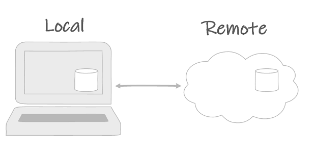
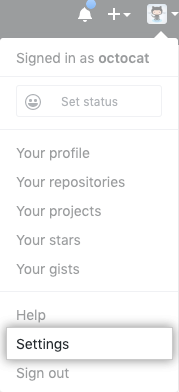
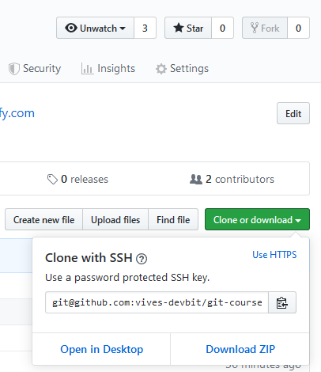

# Collaborating with Git

Git is a distributed version control system, which implies there is no central repository. All collaborators have a local repository upon which they work and share their project. **Local** is the repository on your local system. **Remote** are all the repositories which are on other computers. The default name for a remote is **origin**.



In order to facilitate sharing repositories cloud-based services have been developed such as BitBucket, GitLab and GitHub.

## GitHub

[GitHub](github.com) is a web-based hosting service for code. It is built upon Git and provides project management features, such as bug tracking, feature requests, task management, etc. GitHub is the largest host of source code in the world and hosts the largest open source community. It provides both public open source and private repositories. 

### Sign up 

Register your free account at https://github.com/

### SSH keys

GitHub uses SSH with RSA public key encryption to authenticate users with git. 

1. First, you have to generate an public/private keypair.

    ```bash
    ssh-keygen -t rsa -b 4096 -C "your_email@example.com"
    ```

    ::: output
    Generating public/private rsa key pair.

    Enter a file in which to save the key (/c/Users/you/.ssh/id_rsa):[Press enter]
    :::

    Press enter to confirm the default location.

    ::: output
    Enter passphrase (empty for no passphrase): [Press enter]

    Enter same passphrase again: [Press enter]
    :::

    Press enter twice to generate a keypair without a passphrase.

    Next, locate the public key *id_rsa.pub* and open it with visual studio code.

    ::: warning
    Do not open id_rsa.pub with Publisher.
    :::

2. Copy the contents of id_rsa.pub.
3. Then, on GitHub.com click in the upper-right corner on your profile photo, next click **Settings**.

    

4. In the user settings sidebar, click **SSH and GPG keys**.

    

5. Click New SSH key.

    

6. In the *title* field, add a descriptive label, for instance your computer name.
7. Paste your key into the *key* field
8. Click **Add SSH key**


### Create a new repository

Create a new repository on GitHub.com by clicking new. It's a good practice to create a new repository for each project.


Choose: 
* A repository name
* To make it public or private

Repository initialization depends on whether you start from GitHub or from a local Git repository.

* Starting from a local repository
    1. Do not check "initialize this repository with a README"
    2. In your local git repository
        ```bash
        git remote add origin git@github.com:yourusername/repositoryname.git
        git push origin master
        ```
* Starting from GitHub
    1. Check "initialize this repository with a README"
    2. Optionally choose a preconfigured gitignore file
    3. Optionally choose an open source license
    4. Clone the repository to desktop

### Cloning repositories

Downloading a repository from a remote with git is called **cloning**. 

In order to clone a repository from GitHub navigate to the project page and click **clone or download**.



Then copy the URL, for example *git@github.com:vives-devbit/git-course.git*

Finally, clone the repository:

```bash
git clone <url>
```

### Viewing the remote of a repository

To check the remote URL of a repository, use git remote:

```bash
git remote -v
```

The -v parameter of the remote command shows the remote name and URL. For example:

::: output
origin  git@github.com:vives-devbit/git-course.git (fetch)

origin  git@github.com:vives-devbit/git-course.git (push)
:::

### Pushing a branch to a remote

Uploading commits from your local repository to a remote repository is called a **push**. Typically whole branche are pushed.


For example to push the master branch to origin:

```bash
git push origin master
```

::: tip
The master branch is the default branch of a git repository. 
:::

::: warning
It is not possible to push a branch to a remote if you did not retrieve the latest commits from the remote. Do a git pull before you push.
:::


### Pulling a branch from a remote

Retrieving the latest commits from a remote is called a **pull**. Typically whole branches are pulled. 


For example to pull the master branch from origin:

```bash
git pull origin master
```