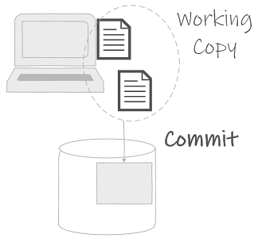
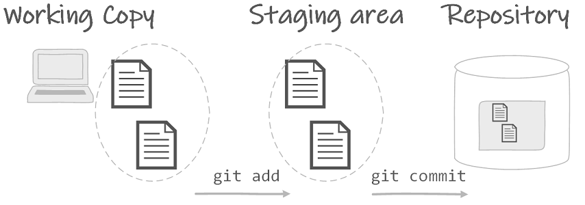

# Git Intro

## Initializing a new repository

Navigate to the project folder and execute in a terminal:

```bash
git init
```

The git init command will initialize a new repository. 


Actually git creates a new repository in a hidden *.git* folder. If you remove the *.git* folder you are actually removing the repository. 

Furthermore, do not create a new repository inside another git repository.

A good rule of thumb is to create a git repository per project. When in doubt, create a new repository.

## Committing changes

Files and folders in the project folder are called the **working copy**. A **commit** is a version of the working copy which has been committed to the repository.



Each commit contains the information to answer the four **W** questions: who, when, why and what?

An example:

```
Author: Chuck Norris
Date: Thu Feb 28 15:52:55 2019
Message: Chuck Norris only tests in production

Added: prod/test
Removed: staging/test
```

* Who? The author of the commit is registered in the git config.
* When? The timestamp when the commit was made.
* Why? This is a message provided by the author, which explains why the commit was made. A typical mistake is to desribe what has been committed, however this is already included in the commit. Note that many developers like to use the present tense in their commit messages. This makes them read like actions on the repository.
* What? These are the actual changes added or removed in this commit with regard to the previous commit.

### Staging the commit

Before committing the working copy to the repository, the files are staged to the **staging** area. Staging allows to prepare the commit, see what will be committed and make changes before actually committing. 



```bash
git add .
```
The git add . command stages all changes in the working copy.

Alternatively, it is possible to stage a single file.

```bash
git add <file>
```

Or to stage a directory and everything included.

```bash
git add <directory>
```

In order to unstage a file, so it is not longer included in the staging area, use 

```bash
git restore --staged <file>
```

::: tip What should be committed?
Source files: code, configuration files, markdown, assets such as figures
In short: all files which cannot be generated. 
::: 

### Ignoring files

Instead of carefully selecting all files which should be staged, it is possible to inform git which files should not be staged.

Make a **.gitignore** file. This is a configuration file providing rules about files and directories which may not be staged. Each line in the file is a new rule.

An example:

```
readme.pdf
node_modules/
*.bin
!library.bin
```

Explanation for the rules of the example line by line:

1. Do not stage the file readme.pdf. 
2. Do not stage the directory node_modules.
3. Do not stage any .bin files. The * is a wildcard.
4. Stage library.bin. The ! indicates an exception to a previous rule.

Commit the .gitignore file to the repository, so all cloned repositories use the same .gitignore file. 

If a file is already committed to the repository, including it in the .gitignore file will not remove it from the repository.

### Current status

At any given moment it is possible to ask for the current status of the working copy. 

```bash
git status
```

This is a very helpful command, often providing useful suggestions about what you might want to do.

### Commit

Once the staging area is in the desired state, commit all staged changes with

```bash
git commit -m"tell why you made the commit in this commit message"
```
Provide a suitable commit message. If you forgot the -m parameter git will start the default editor to construct a message.

## Viewing

A git repository contains a lot of information. Getting an overview of all commits or checking the differences between two commits are common operations when using git.

### View the log

Git log gives an overview of all commits. 

```bash
git log
```
:::output
commit 1240e9ae53707b9cd73ced65327f1b23af359f7b
Author: Piet Cordemans <s...@gmail.com>
Date:   Thu Dec 12 10:02:30 2019 +0100

    posh-git installation debugged

commit 15cf28af09af8fc8ba3b4f0ebe02b50e56759c54
Author: Piet Cordemans <s...@gmail.com>
Date:   Thu Dec 12 09:24:21 2019 +0100

    posh git installation instructions
:::

1. Each commit is identified by a hash. Referring to the commit is usually by part of the hash. Usually 6 to 8 characters are enough to identify the hash of the commit.
2. The author of the commit is included
3. As well as the timestamp of the commit
4. Finally the commit message is shown. In order to quickly identify the commit, an informative commit message is essential.

To view a condensed log containing only the commit hashes and messages

```bash
git log --pretty=oneline
```

### View changes between commits

Git diff shows all differences between two commits, the staging area or the working copy.

To show differences between the working copy and the HEAD commit:

```bash
git diff
```

::: tip
The HEAD commit is the latest commit in the current branch.
:::

Viewing the differences between the staging area and the HEAD commit:

```bash
git diff --staged
```

Using the commit hashes it is also possible to view the changes between two commits, for example:

```bash
git diff 1240e9a 15cf28a
```

## Undoing changes

Reverting all changes in the working copy which have not been staged or committed yet can be done with:

```bash
git restore <file>
```

::: warning
As long as changes are not committed, they might be lost. Be sure to commit what you want to keep.
:::