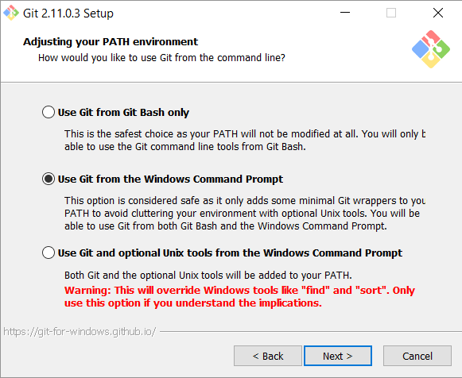

# Git Tools

Git was created by Linus Torvalds for development of the Linux kernel aimed towards data integrity and speed. It quickly became popular not in the least because of [Github](https://github.com), a web-based Git hosting service.

## Git installation

Get the latest Git release from [git-scm.com. ](https://git-scm.com/)Although many Graphical User Interface \(GUI\) clients for Git exist, this tutorial is going to focus on the command line tool. Mainly because the command line interface is a valuable tool for software development and system administration.

When going through the installer, adjust the PATH environment accordingly. If you forget to select to use Git from the Windows Command Prompt it is possible to change the PATH environment variable to include the Git\bin directory.



When selecting a default editor: select Visual Studio Code.

When installed correctly, open a command prompt \(hit windows key, start typing cmd and hit enter\).  All command line input is indicated in the grey rectangle.

```bash
git
```

When you type in the command git, the following output is given, if Git is installed succesfully and it has been added to the PATH environment variable.

```bash
usage: git [--version] [--help] [-C <path>] [-c <name>=<value>]
           [--exec-path[=<path>]] [--html-path] [--man-path] [--info-path]
           [-p | --paginate | -P | --no-pager] [--no-replace-objects] [--bare]
           [--git-dir=<path>] [--work-tree=<path>] [--namespace=<name>]
           <command> [<args>]

These are common Git commands used in various situations:

start a working area (see also: git help tutorial)
   clone     Clone a repository into a new directory
   init      Create an empty Git repository or reinitialize an existing one

```

After installation, Git must be configured with a name and e-mail address. This is important because every Git commit is accompanied with this information.

```bash
git config --global user.name "Firstname Lastname"
git config --global user.email "Firstname.Lastname@example.com"
```

## Posh-git 

[Posh-git](https://github.com/dahlbyk/posh-git) is a Powershell module that provides a status summary of the git repository. It also provides tab completion on git commands, branch names, etc.

1. Open an elevated Powershell terminal. Right-click on powershell and select run as administrator.
2. Set-ExecutionPolicy RemoteSigned -Scope CurrentUser -Confirm2
3. Install-Module PowerShellGet -Scope CurrentUser -Force -AllowClobber
4. Add-PoshGitToProfile
5. Open a new Powershell window

## Visual Studio Code

Visual Studio Code is a lightweight but powerful source code editor which runs on your desktop and is **available for Windows, macOS and Linux**. It comes with built-in support for JavaScript, TypeScript, Node.js, and Git and has a rich ecosystem of **extensions** for other languages (such as C++, C#, Java, Python, PHP, Go) and runtimes (such as .NET and Unity).

Basically it is a great editor for markdown and many other coding projects.

Navigate to [code.visualstudio.com](https://code.visualstudio.com/) and download the latest version.

Follow the installation wizard.

## Fork.dev

Fork is a modern git GUI client. Although this course focusses on command line tools, Fork is a nice graphical alternative.

Download the [Fork installer](https://fork.dev/) 