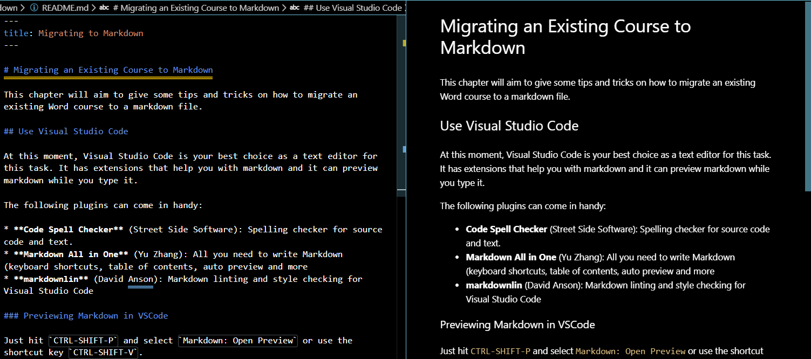

# Migrating an Existing Course to Markdown

This chapter will aim to give some tips and tricks on how to migrate an existing Word course to a markdown file.

## Use Visual Studio Code

At this moment, Visual Studio Code is your best choice as a text editor for this task. It has extensions that help you with markdown and it can preview markdown while you type it.

The following plugins can come in handy:

* **Code Spell Checker** (Street Side Software): Spelling checker for source code and text.
* **Markdown All in One** (Yu Zhang): All you need to write Markdown (keyboard shortcuts, table of contents, auto preview and more
* **markdownlin** (David Anson): Markdown linting and style checking for Visual Studio Code

### Previewing Markdown in VSCode

Just hit `CTRL-SHIFT-P` and select `Markdown: Open Preview` or use the shortcut key `CTRL-SHIFT-V`.



:::warning GitHub and VuePress flavored markdown
Do note that some GitHub or VuePress flavored markdown may not be previewed correctly. Just ignore those and check them on the local site (running with the development server). Typical examples are containers like these.
:::

## Use a development branch

Best is to use a `development` of `dev` branch to work on in git. This will make sure you always have a working version in master.

Finished a chapter and tested it thoroughly on your computer ? Then merge it into `master` and push it to GitHub, automatically triggering a build.

Also make sure to push your development branch to GitHub. That way, you will always have your latest commits stored in the cloud. Unless explicitly linked to Netlify, a push toward other branches than `master` will not trigger a build. So don't worry to break something or waste build-minutes.

Creating and pushing a `dev` branch:

```bash
git checkout master
git checkout -b dev
git push origin dev
```

Merging tested changes from `dev` into `master` can be achieved as follows:

```bash
git checkout master
git merge dev
```

:::warning Clean State
Always make sure to be in a clean state when merging changes or pulling changes. Clean state means no changed files. When executing `git status` it would return `nothing to commit, working tree clean`.
:::

Once tested thoroughly, you can push it using `git push origin master`.

## Use Tags for versions

Want to refactor part of your course at the end of the semester? Than it is also a good idea to tag the current state of your course. This way you will easily find your way back if ever needed.


Creating tags and pushing them can be achieved using the following git commands:

```bash
git tag 2019-2020
git push origin --tags
```

The label or name of the tag can be chosen as you wish.
