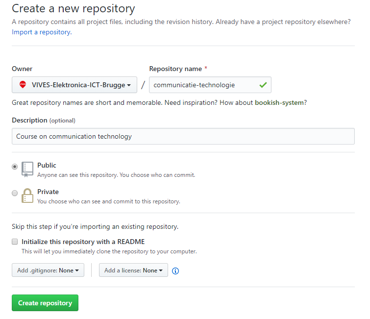
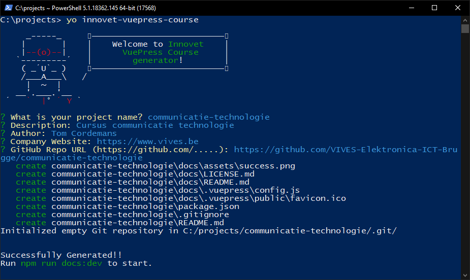

# Setting Up a VuePress Course

The steps described below will get you started with a basic VuePress website, ready for your course material.

## Initial Requirements

Before starting you will need to install some required tools. These steps will only need to be performed once.

### Node.js

Node.js is an open-source, cross-platform, JavaScript runtime environment that executes JavaScript code outside of a browser. Node.js lets developers use JavaScript to write command line tools and for server-side scripting—running scripts server-side to produce dynamic web page content before the page is sent to the user's web browser. Consequently, Node.js represents a "JavaScript everywhere" paradigm,unifying web-application development around a single programming language, rather than different languages for server- and client-side scripts.

To install Node.js, navigate to [nodejs.org](https://nodejs.org) and download the latest long time support version (LTS) for your system.

Follow the installation wizard. You may need to restart your system.

### Visual Studio Code

Visual Studio Code is a lightweight but powerful source code editor which runs on your desktop and is **available for Windows, macOS and Linux**. It comes with built-in support for JavaScript, TypeScript and Node.js and has a rich ecosystem of **extensions** for other languages (such as C++, C#, Java, Python, PHP, Go) and runtimes (such as .NET and Unity).

Basically its the perfect editor for markdown and many other coding projects.

Navigate to [code.visualstudio.com](https://code.visualstudio.com/) and download the latest version.

Follow the installation wizard.

### VuePress Package

VuePress is a minimalistic Vue-powered static site generator that allows static webpages to be generated from markdown files. This makes it a favorite among many developers to document projects and such.

Before one can start using VuePress, its npm (Node Package Manager) package needs to be installed globally on the system.

Open up a PowerShell window and execute the following commands to install the VuePress package.

```bash
npm install -g vuepress
```

You can find much more information at [vuepress.vuejs.org](https://vuepress.vuejs.org).

### Yeoman

Yeoman helps you to kickstart new projects, prescribing best practices and tools to help you stay productive.

To do so, we provide a generator ecosystem. A generator is basically a plugin that can be run with the `yo` command to scaffold complete projects or useful parts.

Yeoman is the tool we will be using to setup a new VuePress course. It will make use of a generator that was tweaked for building courses for this project.

Open up a PowerShell window and install Yeoman and the course generator globally.

```bash
npm install -g yo
npm install -g generator-innovet-vuepress-course
```

## Creating a new VuePress Course

The next steps describe how to setup a new VuePress course. These will need to be revisited every time you create a new course.

### Creating a GitHub repo

First thing to do is to create a new GitHub repository. Make sure to skip initialization or adding a `.gitignore` or `README.md` file.



Next note the full URL of the repository in the address bar. You will need it when creating a new VuePress project. In the previous example the url is `https://github.com/VIVES-Elektronica-ICT-Brugge/communicatie-technologie`.

### Create VuePress Project

Creating a new VuePress course is easily achieved using the generator. Just open a PowerShell window where you wish to place your new course and start the generator:

```bash
yo innovet-vuepress-course
```

::: warning OneDrive
Best not to place VuePress courses (any NodeJS projects for that matter) on OneDrive as they tend to generate a lot of files inside of the `node_modules` directory. OneDrive does not like this very much.
:::

You will be asked a couple of questions which you will need to answer. These will configure your new course website.


